## Prerequisites

 - You have a SAP BTP account or trial account with access to the SAP Integration Suite.
 - You have a SAP Sales and Service Cloud (SAP C4C) tenant.
 - You have a SAP S/4HANA Cloud ERP tenant.
 - The systems are technically connected via SAP Integration Suite, using communication arrangements in both SAP Sales Cloud and SAP S/4HANA Cloud ERP.

## You will learn

 - Add a custom field in SAP Sales and Service Cloud.
 - Create the corresponding custom field in SAP S/4HANA Cloud ERP.
 - Configure a mapping in a custom iFlow, which is triggered by the DirectProcess adapter in SAP Integration Suite.

### Finding the right Integration Flow

Once you have copied the integration package “SAP Sales Cloud Version 2 Integration for Sales Processes with SAP S/4HANA Cloud Public Edition” and connected it accordingly to your corresponding SAP S/4HANA Cloud ERP and SAP Sales and Service Cloud tenants, you can start with the following steps.:

1. In your SAP Integration Suite, go to the Design workspace and search for the integration package “SAP Sales Cloud Version 2 Integration for Sales Processes with SAP S/4HANA Cloud Public Edition”.

2. Open the package and navigate to the Artifacts tab. Select the integration flow: “Create Follow-Up Sales Order in SAP S/4HANA from Sales Quote”.

3. Click on Configure, then switch to the More tab. Set the field Custom Exit to the value true.

    <!-- border -->

4. From now on, the CustomExit (ProcessDirect call) within this integration flow will automatically be used whenever a Sales Order is triggered from SAP Sales and Service Cloud to SAP S/4HANA Cloud ERP.

    <!-- border -->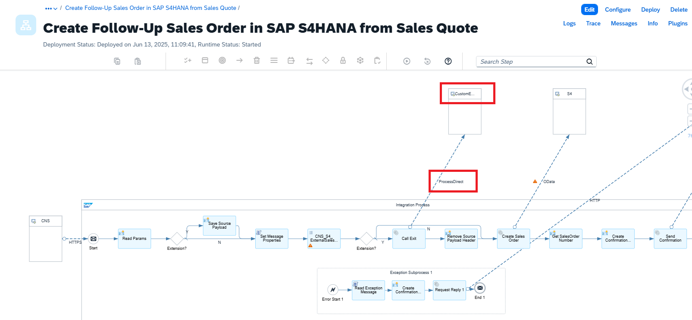

### Extension of Data Model in SAP Sales and Service Cloud (SAP C4C)

In this section, you will create the custom field RespSellerName (Responsible Seller Name) in SAP Sales and Service Cloud:

1. Log on to your SAP Sales and Service Cloud tenant and navigate to: Administrator → Extensibility → Extensibility Administrator.

2. Locate the relevant business object: Sales Order.

3. Create a new custom field with the following properties:

    - Label: Responsible Seller Name
    - Technical Name: RespSellerName
    - Type: Text (String)
    - Length: 20 characters 

    <!-- border -->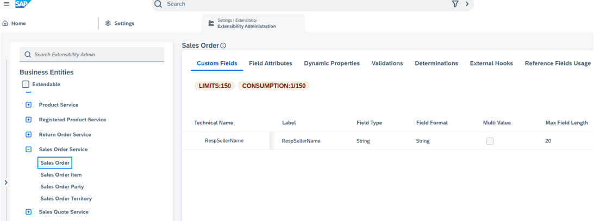

4. Enable the field for:

    - UI usage
    - OData services

5. Save and publish the field to activate it.

6. Creating a new Sales Quote in SAP Sales and Service Cloud.

    - Navigate to the Sales Quotes in SAP Sales and Service Cloud.
    - Click Create to start a new Sales Quote.

7. The new custom field RespSellerName now appear and is ready for input.

    <!-- border -->

### Extension of Data Model in SAP S/4HANA Cloud ERP

In this section, you will create the corresponding custom field RespSellerName (Responsible Seller Name) in SAP S/4HANA Cloud ERP:

1. Log on to your SAP S/4HANA Cloud ERP system and open the Custom Fields app.

2. Create a new field with the following details:

    - Business Context: Sales: Sales Document (SD_SALESDOC)
    - Field Name: RespSellerName
    - Label: RespSellerName
    - Length: Match the Sales Cloud field (20 characters)

    <!-- border -->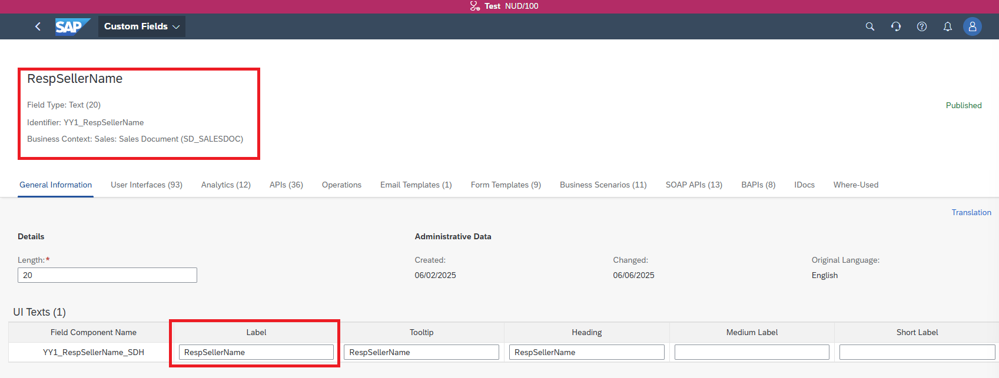

3. Enable the field in Custom Fields app:

    - User Interfaces: C_SALESORDERMANAGE; C_SALESORDERMANAGE_SD
    - APIs: API_SALES_ORDER_SRV; API_SALES_QUOTATION_SRV
    - Business Scenarios: Sales Document Header Level to Billing Due List

    <!-- border -->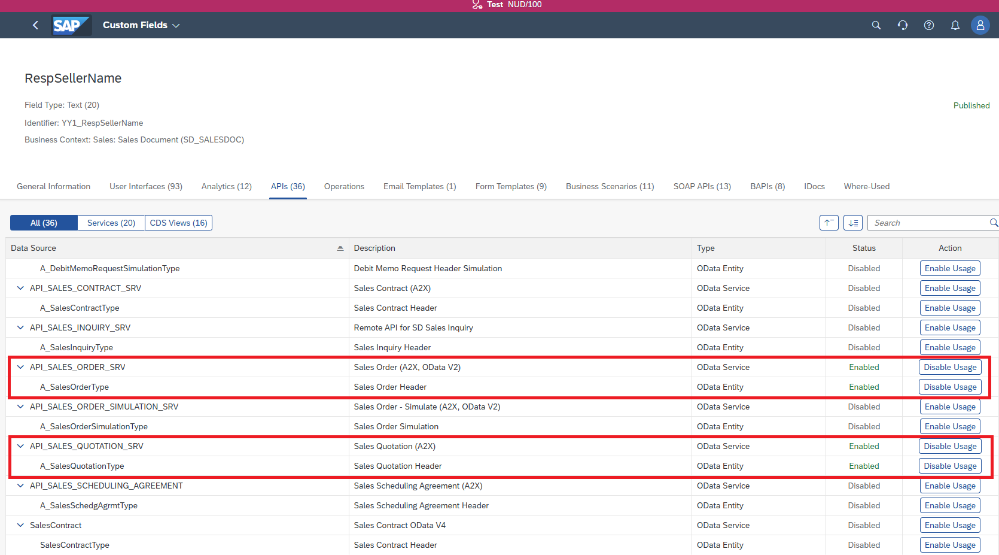

4. Open the Manage Sales Orders app and open an existing Sales Order or create a new one and click on the Profile button:

    <!-- border -->
	
5. Navigate to Basic Data for Order Details and use the Add new field function and the search for field RespSellerName and press OK:

    <!-- border -->
	
6. Adjust the new field accordingly and activate your changes:

    <!-- border -->
	
7. From now on the new custom field is editable within the Sales Order App:

    <!-- border -->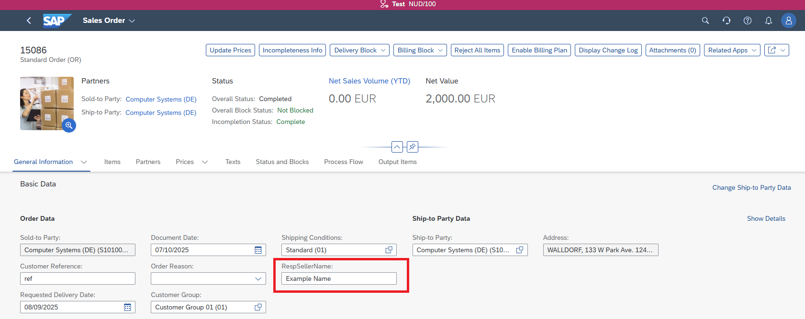

### Create a Custom Integration iFlow Triggered by the Standard iFlow

In this chapter, you will create a custom iFlow that can be called from the standard iFlow “Create Follow-Up Sales Order in SAP S/4HANA from Sales Quote.”:

1. Open the standard iFlow "Create Follow-Up Sales Order in SAP S/4HANA from Sales Quote", navigate to the ProcessDirect call, and check the Connection tab. You will find the endpoint address.

    <!-- border -->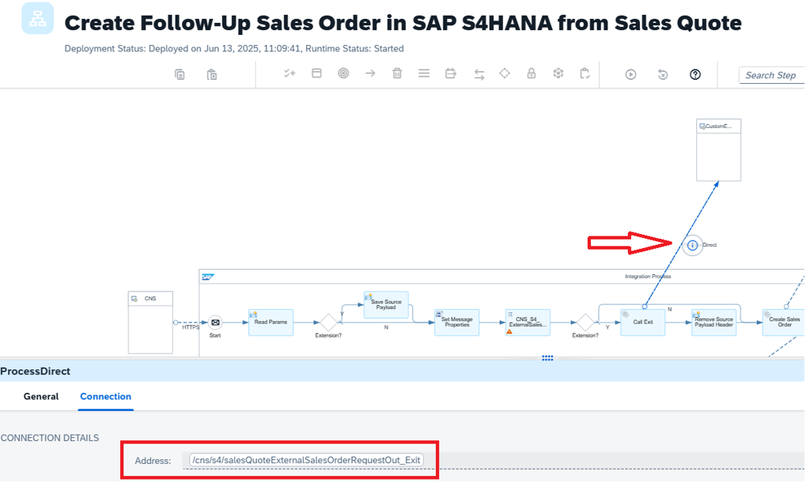

2. Log on to your SAP Integration Suite, open the package "SAP Sales Cloud Version 2 Integration for Sales Processes with SAP S/4HANA Cloud Public", and create a new custom integration flow named DirectProcessAdapter.

    <!-- border -->
	
3. Now select the custom iFlow DirectProcessAdapter, click on the ProcessDirect call, go to the Connection tab, and enter the endpoint from the standard iFlow "/cns/s4/salesQuoteExternalSalesOrderRequestOut_Exit".

    <!-- border -->

### Create the Groovy Script for your Extension Handling

In this chapter, you'll implement a Groovy script artifact named Groovy Script 1 in your custom iFlow to dynamically extract and forward extension fields from the payload:

1. Open the newly created custom iFlow named "DirectProcessAdapter" and click Edit to enable modifications..

    <!-- border -->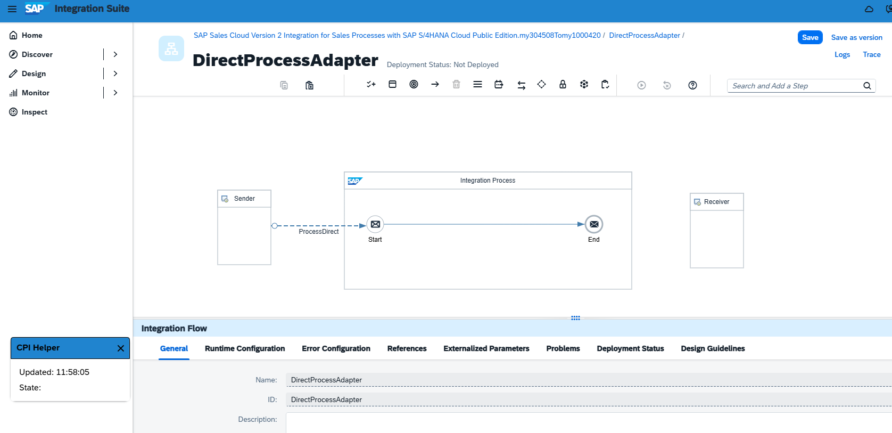

2. Position your cursor over the flow line between the Start and End points, click the plus icon (+), and select the Groovy Script artifact to add it.

    <!-- border -->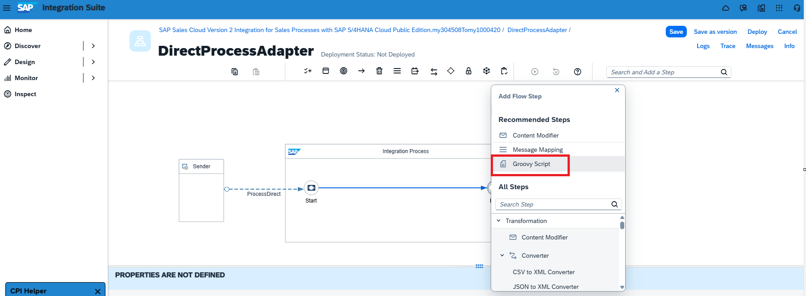

3. Create a new Groovy script file on your local machine, name it script1.groovy, and add the following lines of code:
	
	<!-- cpes-file db/schema.cds -->
    ```JSON
	import com.sap.gateway.ip.core.customdev.util.Message
	import groovy.json.JsonSlurper
	def Message processData(Message message) {
    // Get JSON string from header 'sourcePayload'
    def headerPayload = message.getHeader('sourcePayload', String)
    // Fix potential missing commas between JSON objects (your hacky fix)
    def fixedPayload = headerPayload.replaceAll(/}\s*"/, '}, "')
    // Parse the JSON from header
    def json = new JsonSlurper().parseText(fixedPayload)
    // Get extensions map safely
    def extensions = json?.messageRequests?.getAt(0)?.body?.extensions
    if (extensions != null) {
        extensions.each { key, value ->
            message.setProperty("EXT_" + key, value.toString())
        }
    }
    return message
	}
    ```

    <!-- border -->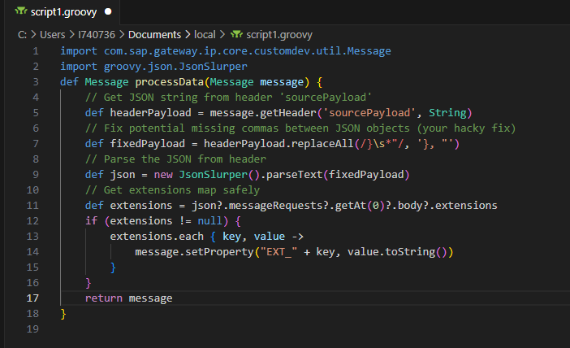
	
4. Press the button Save as version and then the Deploy button.

    <!-- border -->

### Create the Content Modifier for your Extension Handling

In this chapter, you'll implement a Content Modifier artifact to your custom iFlow:

1. Position your cursor over the flow line between the Groovy Script 1 and End point, click the plus icon (+), and select the Content Modifier artifact to add it.

    <!-- border -->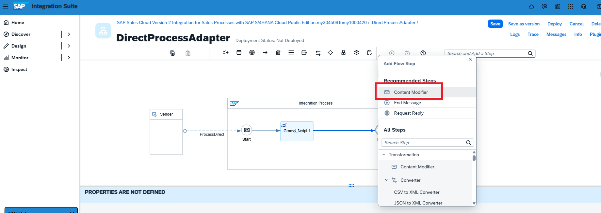

2. Switch to the Exchange Property tab and add a Property with following attributes:

    - Action: Create
    - Name: SalesOrder
    - Source Type: XPath
    - Source Value: /SalesOrder
    - Data Type: String

    <!-- border -->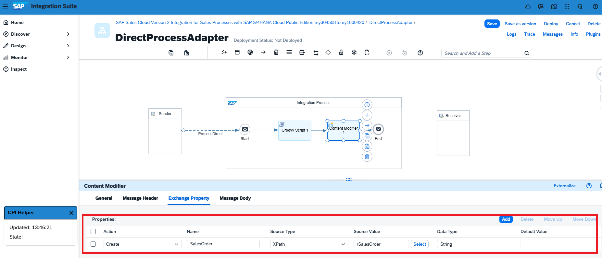
	
3. Press the button Save as version and then the Deploy button.

### Create a Message Mapping Artifact

In this chapter, you'll implement a Message Mapping artifact to your custom iFlow:

1. Position your cursor over the flow line between the Content Modifier and End point, click the plus icon (+), and select the Message Mapping artifact to add it.

    <!-- border -->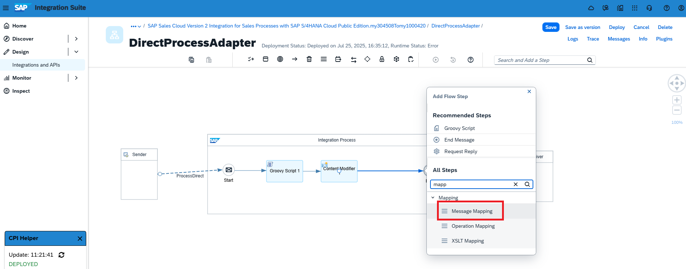

2. Press the button Save as version and then the Deploy button.

3. Switch back to the standard integration flow “Create Follow-Up Sales Order in SAP S/4HANA from Sales Quote” and open the tab “References”. In this tab, locate the Mapping Schema named API_SALES_ORDER_SRV, download it, and save the file on your local computer.

    <!-- border -->

4. Open the newly downloaded file API_SALES_ORDER_SRV in Notepad++ and add the following line below the PropertyRef attributes tag of the Sales Order entity. The property name and corresponding values must be adjusted according to the extension field in your S/4HANA Cloud ERP system.

    - <Property Name="YY1_RespSellerName_SDH" Type="Edm.String" MaxLength="20" sap:display-format="UpperCase" sap:label="RespSellerName" sap:quickinfo="RespSellerName"/>

    <!-- border -->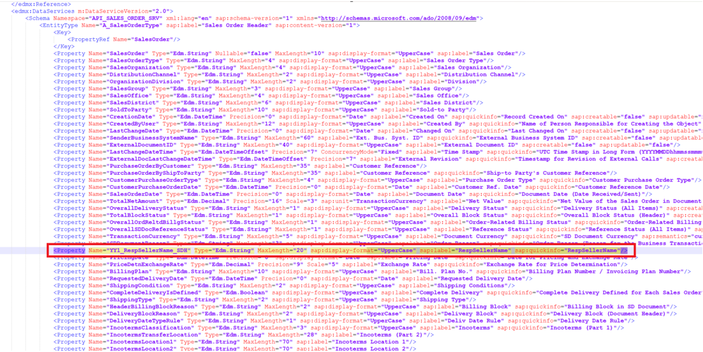

5. Switch back to the iFlow DirectProcessAdapter, click Edit, and open the Reference tab. Click Add, select Schema (EDMX), and upload the extended API_SALES_ORDER_SRV file.

    <!-- border -->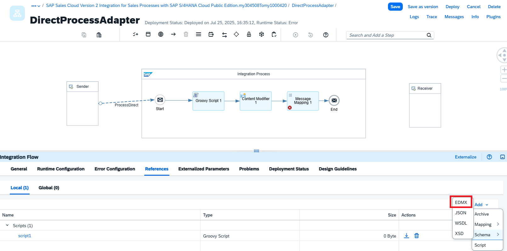
	
6. Then open the Reference tab again, open the newly added mapping file, and verify that the extended line is present.

	<!-- border -->

7. In the DirectProcessAdapter click on the Message Mapping 1 artifact and add a MessageMapping item.

	<!-- border -->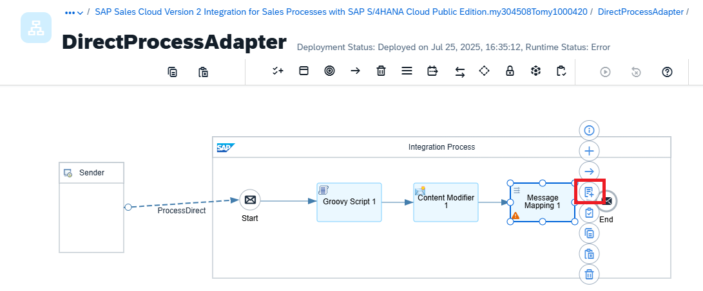
	
8. Now open the DirectProcessAdapter iFlow and switch to the References tab. You will see the newly added MessageMapping item. Click on it, then add the API_SALES_ORDER_SRV file as both the source and target message, selecting the A_SalesOrder element in each case. And click the OK button to confirm your selection.

	<!-- border -->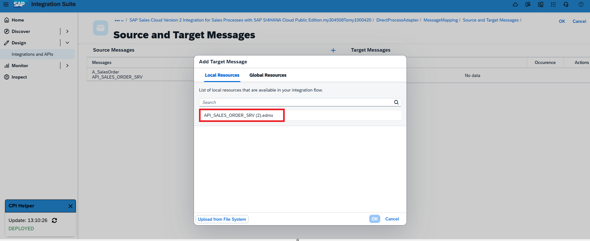

9. Press the button Save as version and then the Deploy button.

11. When triggering the standard iFlow Create Follow-Up Sales Order in SAP S/4HANA from Sales Quote, you can verify the transmission of the extension field by checking the Monitoring view. Within the Mapping artifact CNS_S4_ExternalSalesOrderFollowupRequest, open the Header tab and locate the transmitted extension value "EXT_RespSellerName" under the body.extensions section.

	<!-- border -->

9. Now click again on the Message Mapping 1 artifact, switch to the Processing tab, and open the MessageMapping item. On the target side, locate the extension field and click the Assign Constant button.

	<!-- border -->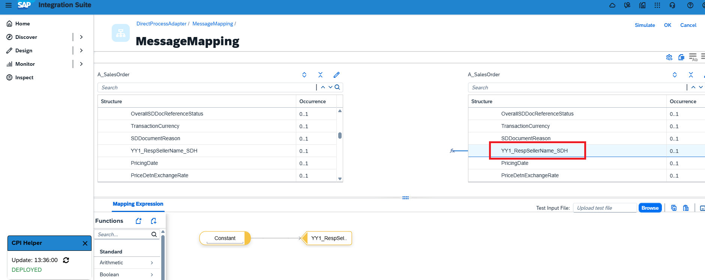

12. Now rename the constant value to EXT_RespSellerName, then click on New functions and select the getProperty function. Then delete the arrow between EXT_RespSellerName and YY1_RespSellerName_SDH, and replace the connection by linking the getProperty function to YY1_RespSellerName_SDH.

	<!-- border -->

13. Please don't forget to press the OK button.

14. Finally, open the Runtime Configuration tab of your DirectProcessAdapter iFlow and add your Source Payload to the Allowed Header(s) field. This ensures that your extension field is passed through and included in the Message Mapping 1 artifact.

	<!-- border -->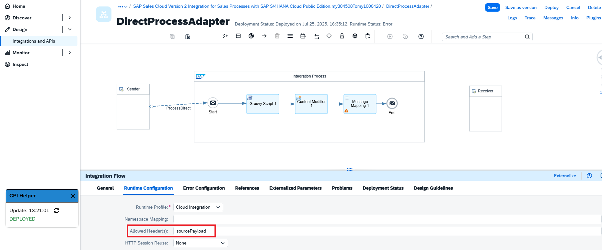

15. Press the button Save as version and then the Deploy button.

### End-to-end Testing and Validation

In this chapter, we will create a Sales Quote in the SAP Sales Cloud system using the extension field, and then generate a Sales Order by transferring the extension field RespSellerName to the SAP S/4HANA Cloud ERP system via the Integration Suite.:

1. Log on to the SAP Sales Cloud system and create a Sales Quote using the extension field RespSellerName, entering a name for testing purposes.

    <!-- border -->

2. The next step is to add a Sales Order, which will automatically trigger the Integration Flow in the background.

    <!-- border -->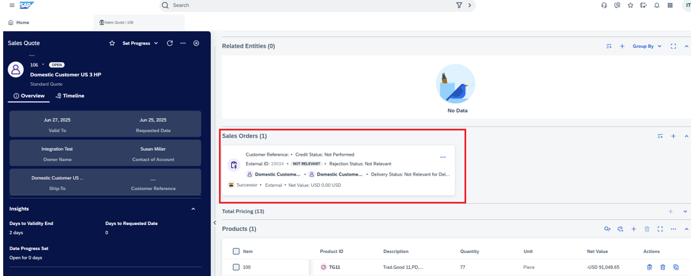

3. In the Integration Flow Message Monitor function, you can check the distributed payloads. Here, you can see that the payloads were successfully transmitted across the entire iFlow and that the custom exit call, which invokes the DirectProcessAdapter, was executed successfully.

	<!-- border -->

4. Log on to the SAP S/4HANA Cloud ERP system and open the Manage Sales Orders app to check for the newly created Sales Order from the Sales Cloud system. Here, you can verify that the corresponding extension field was correctly populated in the target system.

    <!-- border -->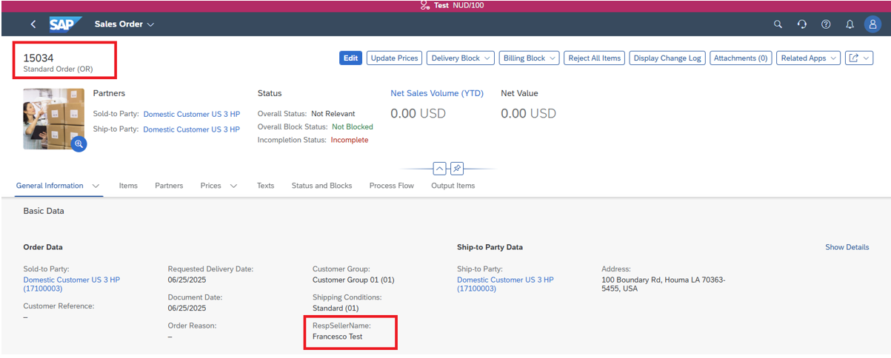

