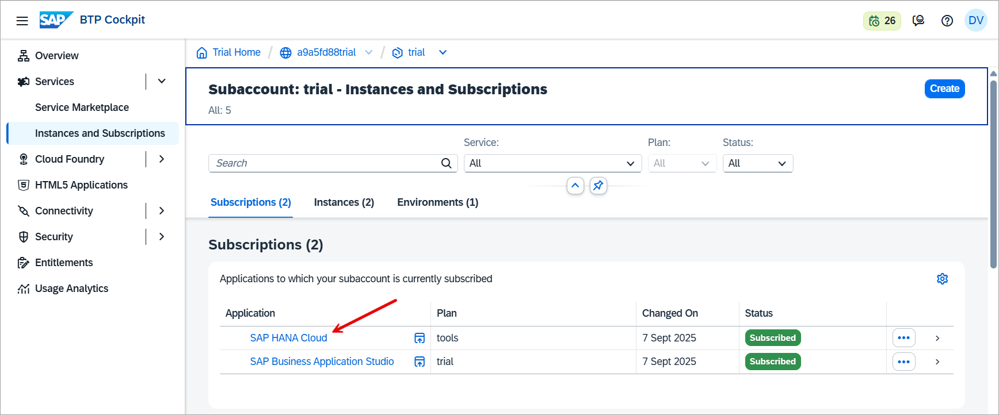
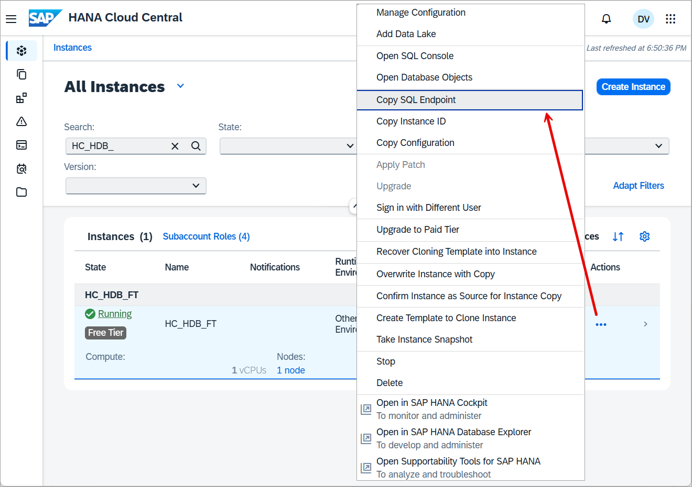
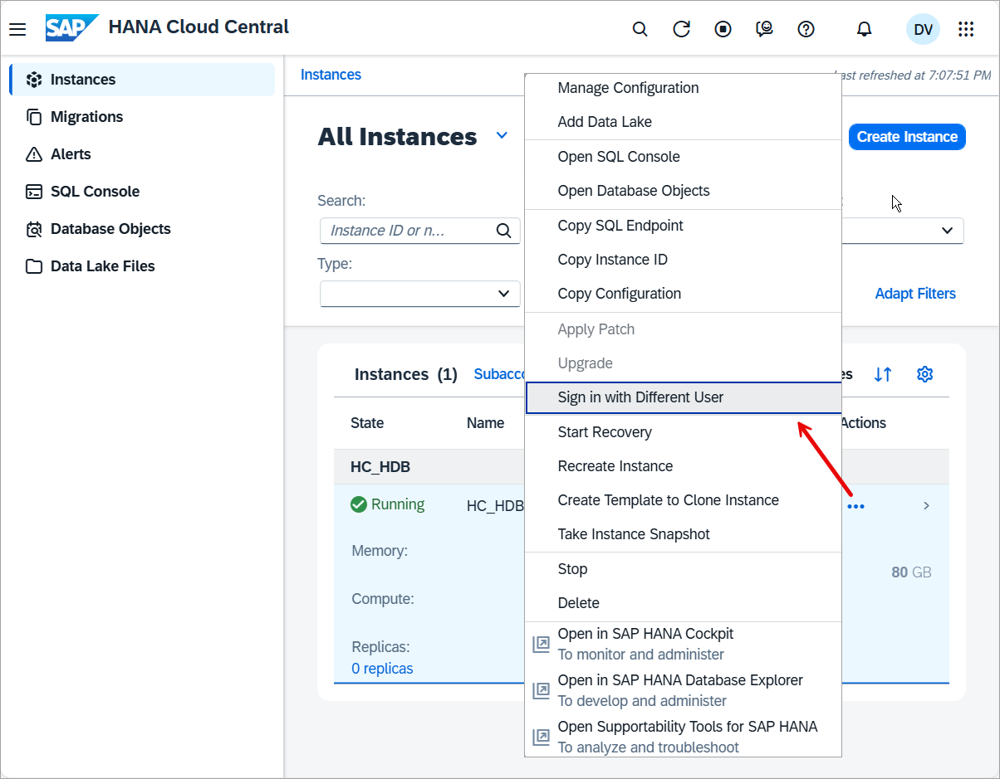

# Tools to Manage and Access the SAP HANA Cloud, SAP HANA Database
<!-- description --> To get started with SAP HANA Cloud, SAP HANA database, you will need to use a few different tools. Learn here what you can use them for.

## Prerequisites
- You have access to [SAP HANA Cloud trial](hana-cloud-mission-trial-2), [SAP HANA Cloud free tier](hana-cloud-mission-trial-2-ft), or a production environment of SAP HANA Cloud, SAP HANA database
- You have completed the tutorial to [provision an instance of SAP HANA Cloud, SAP HANA database](hana-cloud-mission-trial-3)

## You will learn
- How to use SAP HANA Cloud Central
- How to access SAP HANA database explorer
- How to access SAP Business Application Studio

## Intro
>
> 
>
> Reminder: This tutorial is part of a mission, in which you will help Alex, the CEO of Best Run Travel, to answer a concrete business question with SAP HANA Cloud, SAP HANA database.
>
> *Alex needs to know the top 5 partners of their agency and wants to find out the days with maximum booking of each partner.*

In this tutorial, you will get to know the tools you need when interacting with your SAP HANA database in SAP HANA Cloud.

---

### Get to know SAP HANA Cloud Central

SAP HANA Cloud Central is your main administration tool for all SAP HANA Cloud instances. Here you can provision, scale, perform migrations, deal with alerts and issues, and browse and query your instances.

**How to open SAP HANA Cloud Central**

-	In SAP BTP cockpit, open SAP HANA Cloud Central by clicking on the subscription to SAP HANA Cloud in the Subscriptions tab.

    

-	SAP HANA Cloud Central will open in a new tab, where you can manage this instance.

**What you can do in SAP HANA Cloud Central**

-	*Get an overview of all SAP HANA Cloud instances in a subaccount*

-	*Create SAP HANA Cloud instances*

-	*Find an instance using the instance ID*

-	*Check the status of an instance*

-	*Review notifications*

-	*Check the memory, compute, and storage consumption*

-	*Start and stop instances*

-	*Manage and delete instances*

-   *Perform SAP HANA database migrations*

-   *View alerts in the Alerts app*

-   *Run queries in the SQL console tab*

-   *Explore the schema of the database using the database objects app*

**How to find your instances**

-	In SAP HANA Cloud Central you can see all your instances. If you want to manage and maintain multiple instances, you can use the filters and search options on the top center area of the screen. Use **Adapt Filters** to modify the types of filters displayed.

    

**Manage your instances**

-	You can open many options by clicking on the **three dots** under the **Actions** column to each instance on the list. This includes options to manage configurations, start or stop the instance, or delete it. From this menu, you can also open the other tools you can use with your instances, such as SAP HANA database explorer.

-	One of the most important options you can get is the **SQL Endpoint** of your instance. To do so, click **Copy SQL Endpoint**. You will need this for multiple tasks, such as connecting to other systems.

    

    To learn about more options to create and manage instances with SAP HANA Cloud Central, you can refer to the [**SAP HANA Cloud Administration with SAP HANA Cloud Central Guide**](https://help.sap.com/docs/hana-cloud/sap-hana-cloud-administration-guide/sap-hana-cloud-administration-guide).

**View details of an instance**

Click on an instance to see further details of an instance including:

  - *Memory*
  * *Compute*
  * *Network*
  * *Storage*
  * *Consumption*
  * *User & Authorization Management*
  * *Workload Management*
  * *Data Replication*
  * *Auditing*
  * *Performance Details including expensive statements*

    
    

    Based on this information, you can make important decisions on how to manage and optimize your instances.   

**Provide database authentication**

Initially, you are signed in with the DBADMIN database user and the password specified during the instance provisioning wizard.  This can be changed using this is the first-time you are accessing a database instance, you will need to **Choose Authentication** and enter the credentials of your DBADMIN user.

### Get to know the SAP HANA database explorer

SAP HANA database explorer allows you to interact with SAP HANA databases, as well as use the SAP Graph and Spatial engines. You also have access to the SQL console.  It can be accessed from the actions menu of an instance.

>**Note**: The SQL console and catalog details can now be accessed directly in HANA Cloud Central by clicking on the SQL console or database objects toolbar items or through the actions menu.
>
>
>
>After connecting to a database instance, you can execute SQL queries or browse catalog objects.
>
>
>
>Learn more about how to use the SQL console and database objects in HANA Cloud Central by visiting [Query Databases Using the SQL Console in SAP HANA Cloud Central](hana-dbx-hcc) and [Browse and Explore Catalog Objects with the Database Objects App](hana-dbx-database-objects).

**What you can do in SAP HANA database explorer**

The SAP HANA database explorer offers a graphical interface and the SQL console, allowing you to freely access and manage your data.

In SAP HANA database explorer, you can:

-	*Browse the database catalog*

-	*Execute SQL statements*

-	*Debug stored procedures*

-	*Add, remove, or manage remote sources*

-	*Import, and export data*

-	*View diagnostic files*

If you want to view, add, or manage any of the catalog items, right click on the item and choose from the available options.

An important part of the SAP HANA database explorer is the **Catalog** browser. Each database on the SAP HANA database explorer has its own catalog that allows you to view data, execute SQL commands, and manage remote sources, among other tasks.

**How to open SAP HANA database explorer**

1.	Open SAP HANA Cloud Central.

2.	In the row of the SAP HANA Cloud database instance you want to open in SAP HANA database explorer, click on the **three dots** in the **Actions** column.

3.	Then, click on **Open in SAP HANA database explorer**.

    

4.	The SAP HANA database explorer will open on a new tab. If this is the first-time you are accessing it, you will need to enter the credentials of your DBADMIN user.

> In this mission, you will use the SAP HANA database explorer for many tasks, so we recommend you bookmark it for easy access.

For more information on how to use the SAP HANA database explorer, you can also check out the tutorial group [Get Started with the SAP HANA database explorer](group.hana-cloud-get-started) or refer to the [technical documentation](https://help.sap.com/viewer/a2cea64fa3ac4f90a52405d07600047b/LATEST/en-US/7fa981c8f1b44196b243faeb4afb5793.html).

### Get to know SAP Business Application Studio

SAP Business Application Studio is a development environment available for users with SAP HANA Cloud, SAP HANA database. There, you can create your development projects and model your data, including calculation views. This is also the tool you can use to build custom applications that connect and make use of your SAP HANA Cloud databases.

Using SAP Business Application Studio is not strictly necessary to use your trial instance, but if you would like to use calculation views and create applications it is strongly recommended. In this mission, you will learn to use it.

**What you can do in SAP Business Application Studio**

The SAP Business Application Studio provides tools specific to building business applications within the SAP ecosystem, covering the end-to-end development cycle. You can:

-	*Create development spaces*

-	*Clone an existing project*

-	*Create a new project using a template*

-	*Use editors for SAP-specific technologies*

-	*Test your application while consuming services from remote sources*

-	*Build and deploy you application as a multi-target application*  

> To use SAP Business Application Studio, you need be subscribed to this service within the SAP BTP Cockpit. You must also have Cloud Foundry enabled to add the SAP Business Application Studio entitlement to your trial account.
>
> If you are using a *trial account*, you can subscribe automatically via the **quick tool access**.
>
> If you are **not** using a trial account or you have added SAP HANA Cloud to an existing SAP BTP trial, you need to **subscribe manually**.
>
> Select the option that applies to you by clicking on the options below the step title.

[OPTION BEGIN [Quick tool access]]

**Quick tool access in trial**

1.	Go to the [SAP BTP Cockpit trial home page](https://account.hanatrial.ondemand.com/trial/#/home/trial).

    

2.	After logging in, click on the **SAP Business Application Studio** button under the **Quick Tool Access** area.

5.	A new tab will open with SAP Business Application Studio.

6.	Click **OK** to accept the privacy statement if this is your first-time accessing SAP Business Application Studio.

7.	We recommend that you bookmark this URL so you can easily return to the SAP Business Application Studio.

    > You can learn more about the SAP Business Application Studio by visiting the documentation [here](https://help.sap.com/docs/bas/sap-business-application-studio/what-is-sap-business-application-studio).

[OPTION END]
[OPTION BEGIN [Subscribe manually]]

**Manually subscribe to SAP Business Application Studio**

1.	Navigate to your **Subaccount**.

2.	Click on **Service Marketplace** on the left side of the screen.

3.	Scroll down or use the search bar to find **SAP Business Application Studio** and click on the three dots and choose **Create** to add a subscription.  If you can see the option **Go to Application**, you are already subscribed.

    

4.  Click on **Security** and then **Users**.

    

     Select the user that will be using the Business Application Studio and add the role collection **`Business_Application_Studio_Developer`**.

     

5.	Open the SAP Business Application Studio.

    

6.	Click on **OK** to accept the privacy statement if this is your first-time accessing SAP Business Application Studio.

7.	We recommend that you bookmark this URL so you can easily return to the SAP Business Application Studio.

    > You can learn more about SAP Business Application Studio [here](https://help.sap.com/docs/bas/sap-business-application-studio/what-is-sap-business-application-studio).

[OPTION END]

Well done!

You have completed the fourth tutorial of this mission! Now you know how to access the tools you need to make the best use of your SAP HANA Cloud, SAP HANA database instances. Learn in the next tutorial how to import data into your SAP HANA Cloud database.

### Knowledge Check

---
